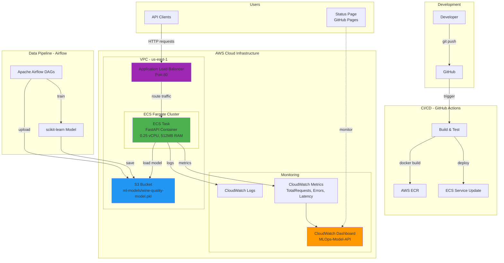

# MLOps Cloud Demo

> **Portfolio Project**: End-to-end MLOps pipeline showcasing data engineering, ML model training, cloud deployment, and infrastructure as code best practices.

**🚀 Live Deployment**: ML API running on AWS ECS Fargate  
**📊 Status Dashboard**: https://dataappengineer.github.io/mlops-cloud-demo/  
**🔗 API Endpoint**: `http://mlops-demo-dev-alb-1849542828.us-east-1.elb.amazonaws.com`  
**📋 Project Board**: [View Development Progress](https://github.com/users/dataappengineer/projects/9/views/1)


## 🏗️ Architecture



## 🎯 What This Project Demonstrates

- ✅ **Data Pipeline Orchestration** with Apache Airflow
- ✅ **ML Model Training & Artifact Management** with scikit-learn and S3
- ✅ **Production API Development** with FastAPI (health checks, structured logging, error handling)
- ✅ **Cloud Infrastructure as Code** with Terraform (VPC, ECS Fargate, ALB, ECR, IAM)
- ✅ **Container Orchestration** with Docker and AWS ECS
- ✅ **CI/CD Pipeline** with GitHub Actions (automated testing and deployment)
- ✅ **Production Monitoring** with CloudWatch (metrics, dashboards, alarms)
- ✅ **Least-Privilege IAM** security practices (separate admin/dev users)

## 🏗️ Project Structure

```
mlops-cloud-demo/
├── data-pipeline/         # Airflow DAGs for data ingestion & preprocessing
├── model-api/             # FastAPI REST API (deployed on AWS ECS)
├── infrastructure/        # Terraform IaC for AWS cloud resources
└── docs/                  # Architecture documentation & learning notes
```

### Components

- **[data-pipeline/](./data-pipeline/)**: Apache Airflow DAGs for automated data ingestion, cleaning, validation, and S3 upload. Includes Docker Compose setup for local development.

- **[model-api/](./model-api/)**: FastAPI REST API serving wine quality predictions. **Currently deployed on AWS ECS Fargate** with Application Load Balancer, CloudWatch logging, and S3-based model loading.

- **[infrastructure/](./infrastructure/)**: Terraform configurations provisioning AWS infrastructure (VPC, ECS Cluster, ALB, ECR, IAM roles, Security Groups). Free Tier optimized.

- **[docs/](./docs/)**: Comprehensive documentation including AWS setup guides, ECS architecture explanations, and technical decision notes.

## 🧪 Testing the Deployed API

The wine quality prediction API is live on AWS. Test it with:

### Health Check
```bash
curl http://mlops-demo-dev-alb-1849542828.us-east-1.elb.amazonaws.com/health
```

**Expected Response:**
```json
{
  "status": "healthy",
  "timestamp": 1766950011,
  "checks": {
    "model": "healthy",
    "s3": "healthy"
  }
}
```

### Prediction Request
```bash
curl -X POST http://mlops-demo-dev-alb-1849542828.us-east-1.elb.amazonaws.com/predict \
  -H "Content-Type: application/json" \
  -d '{
    "features": {
      "fixed_acidity": 7.4,
      "volatile_acidity": 0.7,
      "citric_acid": 0.0,
      "residual_sugar": 1.9,
      "chlorides": 0.076,
      "free_sulfur_dioxide": 11,
      "total_sulfur_dioxide": 34,
      "density": 0.9978,
      "ph": 3.51,
      "sulphates": 0.56,
      "alcohol": 9.4
    }
  }'
```

**Expected Response:**
```json
{
  "prediction": 5,
  "confidence": 0.98,
  "model_version": "1.0",
  "processing_time_ms": 16.89
}
```

**📊 Live Monitoring**: [View Status Dashboard](https://dataappengineer.github.io/mlops-cloud-demo/)  
**📖 API Documentation**: Visit `http://mlops-demo-dev-alb-1849542828.us-east-1.elb.amazonaws.com/docs` for interactive Swagger UI.

## 🚀 Quick Start

### Prerequisites
- Docker & Docker Compose
- AWS Account with CLI configured
- Terraform 1.0+ (for infrastructure provisioning)
- Python 3.9+

### Local Development

#### Data Pipeline
```bash
cd data-pipeline
cp .env.example .env  # Add your AWS credentials
docker build -t mlops-airflow:custom-2.8.1 .
docker-compose up -d
# Access Airflow UI: http://localhost:8080 (admin/admin)
```

#### Model API (Local Testing)
```bash
cd model-api
docker-compose up -d
# Access API docs: http://localhost:8000/docs
```

### Cloud Deployment

#### Infrastructure Provisioning
```bash
cd infrastructure/terraform
cp terraform.tfvars.example terraform.tfvars  # Configure AWS settings
terraform init
terraform plan
terraform apply
```

#### Docker Image Deployment
```bash
cd model-api
# Login to ECR
aws ecr get-login-password --region us-east-1 --profile mlops-admin | \
  docker login --username AWS --password-stdin \
  982248023588.dkr.ecr.us-east-1.amazonaws.com

# Build and push
docker build -t mlops-demo-model-api:latest .
docker tag mlops-demo-model-api:latest \
  982248023588.dkr.ecr.us-east-1.amazonaws.com/mlops-demo-model-api:latest
docker push 982248023588.dkr.ecr.us-east-1.amazonaws.com/mlops-demo-model-api:latest

# Force ECS service update
aws ecs update-service \
  --cluster mlops-demo-dev-cluster \
  --service mlops-demo-dev-model-api \
  --force-new-deployment \
  --region us-east-1 \
  --profile mlops-admin
```

## 📚 Documentation

- **[ECS Architecture Explained](./docs/aws-setup/ecs-architecture-explained.md)**: Deep dive into AWS ECS Fargate, ALB, and networking
- **[Learning Journey](./docs/learning-journey.md)**: Iterative development process, challenges, and solutions
- **[AWS Setup](./docs/aws-setup/)**: Detailed AWS configuration, IAM policies, and security best practices
- **[Technical Notes](./docs/technical-notes/)**: Implementation decisions and problem-solving approaches

## 🏛️ Infrastructure Architecture

**AWS Resources Deployed:**
- **VPC**: 10.0.0.0/16 with 2 public + 2 private subnets across 2 AZs
- **ECS Fargate**: Serverless container orchestration (0.25 vCPU, 512MB RAM)
- **Application Load Balancer**: HTTP traffic routing with health checks
- **ECR**: Docker image registry with lifecycle policies
- **IAM Roles**: Least-privilege task execution and S3 access roles
- **Security Groups**: Network isolation (ALB → port 80, ECS → port 8000 from ALB only)
- **CloudWatch**: Custom metrics, dashboards, and log aggregation

**Monitoring & Observability:**
- **CloudWatch Metrics**: TotalRequests, Errors, AverageResponseTime, ModelLoaded
- **CloudWatch Dashboards**: Real-time API health visualization
- **CloudWatch Logs**: Structured logging with 7-day retention
- **CI/CD Status Badge**: Live deployment health indicator

**Cost Optimization:**
- Free Tier eligible (750 ECS Fargate hours/month for 12 months)
- NAT Gateway disabled (tasks use public IPs in private subnets)
- Minimal compute resources (0.25 vCPU)
- Expected cost: ~$0/month (Free Tier) → ~$25/month after 12 months

## 🎯 Project Milestones

- ✅ **Data Pipeline**: Automated Airflow DAGs for ingestion, validation, and S3 upload
- ✅ **Model Training**: Wine quality prediction with scikit-learn
- ✅ **REST API**: FastAPI with Pydantic validation, structured logging, health checks
- ✅ **Infrastructure as Code**: Complete Terraform setup for AWS ECS deployment
- ✅ **Cloud Deployment**: Live API on AWS ECS Fargate with Application Load Balancer
- ✅ **Security**: IAM least-privilege policies, separate admin/dev users
- ✅ **CI/CD Pipeline**: GitHub Actions with automated testing and deployments
- ✅ **Production Monitoring**: CloudWatch metrics, dashboards, and alarms

**Future Enhancements:**
- 📋 Analytics UI Dashboard (Issue #9)
- 📋 Docker Optimization: Multi-stage builds for smaller images (Issue #26)
- 📋 A/B Testing Framework
- 📋 MLflow Integration for experiment tracking

## 💡 Key Technical Achievements

This project showcases:

**Infrastructure & DevOps:**
- Infrastructure as Code with Terraform (VPC, ECS, ALB, IAM)
- Containerization with Docker (multi-stage builds, health checks)
- AWS cloud architecture (Fargate, ECR, CloudWatch, S3)
- Security best practices (least-privilege IAM, MFA, Security Groups)
- CI/CD with GitHub Actions (test → build → deploy)

**Data Engineering:**
- Workflow orchestration with Apache Airflow
- Data validation and quality checks
- S3 integration for data lake storage
- Automated ETL pipelines

**ML Engineering:**
- FastAPI REST API with OpenAPI documentation
- Model artifact management (S3 + versioning)
- Request/response validation with Pydantic
- Structured logging and error handling
- Sub-20ms prediction latency
- CloudWatch metrics integration
- Comprehensive test coverage with pytest

**Software Engineering:**
- Monorepo structure with independent components
- Git best practices (conventional commits, feature branches, PRs)
- Documentation-first development
- Environment-specific configurations

See [docs/learning-journey.md](./docs/learning-journey.md) and [docs/ARCHITECTURE.md](./docs/ARCHITECTURE.md) for detailed technical stories and problem-solving approaches.

---

**Status**: Production-Ready ✅  
**Last Updated**: December 29, 2025  
**Author**: Giovanni Brucoli ([dataappengineer](https://github.com/dataappengineer))
