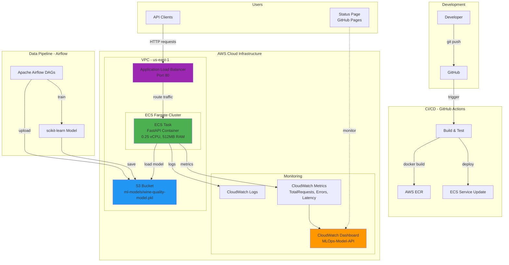

# MLOps Cloud Demo

## ⚡ Project Status: Evolved

**March 2026 Update**: This project achieved its original goal — demonstrating 
cost-efficient MLOps for startups at $12.34/month. 

The infrastructure patterns, Airflow DAGs, FastAPI scaffold, Terraform modules, 
and S3 architecture built here have been **recycled into a new project**: a PE 
portfolio data optimization demo powering [ctrlshift.now](https://ctrlshift.now).

This repo is now **archived as a reference implementation**. The wine quality 
dataset was a placeholder — the real signal was always the infrastructure story: 
systematic cost optimization, evidence-based decisions, production-grade MLOps 
on a startup budget.

**See the successor project**: [diagnostic-web-app](https://github.com/dataappengineer/diagnostic-web-app)

---

> **Portfolio Project**: End-to-end MLOps pipeline showcasing data engineering, ML model training, cloud deployment, and infrastructure as code best practices.

**🚀 Live Deployment**: ML API running on AWS ECS Fargate  
**📊 Status Dashboard**: https://dataappengineer.github.io/mlops-cloud-demo/  
**🔗 API Endpoint**: `http://mlops-demo-dev-alb-1849542828.us-east-1.elb.amazonaws.com`  
**📋 Project Board**: [View Development Progress](https://github.com/users/dataappengineer/projects/9/views/1)


---

## 💼 Project Context: Real Production ML Under Budget

This project demonstrates **cost-efficient MLOps for startups** through a realistic scenario: [VinoExpress](docs/business-case/vinoexpress-client-brief.md), a Colombian wine distributor needing automated quality prediction under a **$450/month infrastructure budget**.

**The Challenge**: Deploy a production ML API (24/7 availability, <1 second response time) while evaluating AWS SageMaker ($150-200/month), AWS EKS ($93-113/month), and AWS ECS Fargate.

**The Solution**: ECS Fargate at **$12.34/month** (97% under budget) — achieved through systematic optimization:
- Started at $21.24/month (unoptimized)
- Discovered two cost leaks via CloudWatch monitoring
- Optimized to $12.34/month in 48 hours (42% reduction)

**Why This Matters**: Budget-conscious startups (US, EU, LATAM, global) need evidence-based infrastructure decisions. This project proves **cost transparency as competitive advantage** — not promises, but receipts (AWS billing data, CloudWatch metrics, systematic verification).

📖 **Read the full story**: [VinoExpress Client Brief](docs/business-case/vinoexpress-client-brief.md)  
📊 **Architecture decisions**: [Decision Matrix: SageMaker vs EKS vs ECS](docs/business-case/architecture-decision-matrix.md)  
💰 **Detailed costs**: [AWS Cost Reference](docs/AWS_COST_REFERENCE.md)

---

## 💰 Cost Transparency: The Optimization Journey

**Monthly Cost Evolution:**
- **Starting Point** (Dec 28, 2025): $21.24/month (unoptimized)
- **After Optimization** (Jan 5, 2026): **$12.34/month** (42% reduction)
- **Post-Free-Tier** (June 2026+): $38.56/month

**How We Got Here:**

1. **Discovery** (Jan 4): CloudWatch monitoring revealed health check overhead consuming 95% of free tier API quota
   - **Action**: Disabled metrics for health endpoints (preserved logging)
   - **Savings**: ~$8.00/month

2. **Discovery** (Jan 5): ECS ContainerInsights publishing 38 metrics (28-metric overage)
   - **Action**: Disabled ContainerInsights, kept 5 business-critical metrics
   - **Savings**: $9.90/month

3. **Verification** (Jan 6): 48-hour checkpoint confirmed both optimizations working
   - AWS CLI metrics: ContainerInsights stopped publishing ✅
   - CloudWatch logs: Health checks running but not metering ✅
   - AWS billing: Tracking $8.11/month Fargate (under $8.89 projected) ✅

**Current Infrastructure Cost:**
- **ECS Fargate**: $8.89/month (0.25 vCPU, 512MB, 24/7)
- **VPC Public IPv4**: $3.45/month (2 Elastic IPs, overage after 750 free hours)
- **Everything Else**: $0.00 (within AWS Free Tier limits)

**Key Insight**: Cost efficiency isn't about "picking cheapest" — it's about **systematic monitoring → discovery → optimization → verification**. Every decision is documented with evidence ([Issues #28](https://github.com/dataappengineer/mlops-cloud-demo/issues/28), [#30](https://github.com/dataappengineer/mlops-cloud-demo/issues/30), [#31](https://github.com/dataappengineer/mlops-cloud-demo/issues/31)).

💡 **For Startups**: This demonstrates capability to deliver production ML without breaking the bank — critical for remote teams, bootstrapped founders, and cost-conscious scale-ups globally.

---

## 🏗️ Architecture


```mermaid
graph TB
    subgraph "Development"
        Dev[Developer] -->|git push| GH[GitHub]
    end
    
    subgraph "CI/CD - GitHub Actions"
        GH -->|trigger| CI[Build & Test]
        CI -->|docker build| ECR[AWS ECR]
        CI -->|deploy| ECS[ECS Service Update]
    end
    
    subgraph "AWS Cloud Infrastructure"
        subgraph "VPC - us-east-1"
            ALB[Application Load Balancer<br/>Port 80]
            
            subgraph "ECS Fargate Cluster"
                Task1[ECS Task<br/>FastAPI Container<br/>0.25 vCPU, 512MB RAM]
            end
            
            ALB -->|route traffic| Task1
            Task1 -->|load model| S3[S3 Bucket<br/>ml-models/wine-quality-model.pkl]
        end
        
        subgraph "Monitoring"
            Task1 -->|logs| CWL[CloudWatch Logs]
            Task1 -->|metrics| CWM[CloudWatch Metrics<br/>TotalRequests, Errors, Latency]
            CWM --> Dashboard[CloudWatch Dashboard<br/>MLOps-Model-API]
        end
    end
    
    subgraph "Users"
        Client[API Clients] -->|HTTP requests| ALB
        Status[Status Page<br/>GitHub Pages] -.->|monitor| Dashboard
    end
    
    subgraph "Data Pipeline - Airflow"
        Airflow[Apache Airflow DAGs] -->|upload| S3
        Airflow -->|train| Model[scikit-learn Model]
        Model -->|save| S3
    end
    
    style Task1 fill:#4CAF50
    style Dashboard fill:#FF9800
    style S3 fill:#2196F3
    style ALB fill:#9C27B0
```

## 🎯 What This Project Demonstrates

### Business & Strategic Skills
- ✅ **Cost-Aware Architecture Decisions** — Evaluated SageMaker, EKS, and ECS Fargate with [decision matrix](docs/business-case/architecture-decision-matrix.md)
- ✅ **Evidence-Based Optimization** — Reduced costs 42% through systematic monitoring (see [optimization journey](docs/business-case/vinoexpress-client-brief.md#the-optimization-journey))
- ✅ **Transparent Cost Tracking** — All AWS billing documented in [cost reference](docs/AWS_COST_REFERENCE.md)
- ✅ **Business Case Development** — Real client scenario with budget constraints and ROI analysis

### Technical & Engineering Skills
- ✅ **Data Pipeline Orchestration** with Apache Airflow
- ✅ **ML Model Training & Artifact Management** with scikit-learn and S3
- ✅ **Production API Development** with FastAPI (health checks, structured logging, error handling)
- ✅ **Cloud Infrastructure as Code** with Terraform (VPC, ECS Fargate, ALB, ECR, IAM)
- ✅ **Container Orchestration** with Docker and AWS ECS
- ✅ **CI/CD Pipeline** with GitHub Actions (automated testing and deployment)
- ✅ **Production Monitoring** with CloudWatch (metrics, dashboards, alarms)
- ✅ **Least-Privilege IAM** security practices (separate admin/dev users)

## 🏗️ Project Structure

```
mlops-cloud-demo/
├── data-pipeline/         # Airflow DAGs for data ingestion & preprocessing
├── model-api/             # FastAPI REST API (deployed on AWS ECS)
├── infrastructure/        # Terraform IaC for AWS cloud resources
└── docs/                  # Architecture documentation & learning notes
```

### Components

- **[data-pipeline/](./data-pipeline/)**: Apache Airflow DAGs for automated data ingestion, cleaning, validation, and S3 upload. Includes Docker Compose setup for local development.

- **[model-api/](./model-api/)**: FastAPI REST API serving wine quality predictions. **Currently deployed on AWS ECS Fargate** with Application Load Balancer, CloudWatch logging, and S3-based model loading.

- **[infrastructure/](./infrastructure/)**: Terraform configurations provisioning AWS infrastructure (VPC, ECS Cluster, ALB, ECR, IAM roles, Security Groups). Free Tier optimized.

- **[docs/](./docs/)**: Comprehensive documentation including AWS setup guides, ECS architecture explanations, and technical decision notes.

## 🧪 Testing the Deployed API

The wine quality prediction API is live on AWS. Test it with:

### Health Check
```bash
curl http://mlops-demo-dev-alb-1849542828.us-east-1.elb.amazonaws.com/health
```

**Expected Response:**
```json
{
  "status": "healthy",
  "timestamp": 1766950011,
  "checks": {
    "model": "healthy",
    "s3": "healthy"
  }
}
```

### Prediction Request
```bash
curl -X POST http://mlops-demo-dev-alb-1849542828.us-east-1.elb.amazonaws.com/predict \
  -H "Content-Type: application/json" \
  -d '{
    "features": {
      "fixed_acidity": 7.4,
      "volatile_acidity": 0.7,
      "citric_acid": 0.0,
      "residual_sugar": 1.9,
      "chlorides": 0.076,
      "free_sulfur_dioxide": 11,
      "total_sulfur_dioxide": 34,
      "density": 0.9978,
      "ph": 3.51,
      "sulphates": 0.56,
      "alcohol": 9.4
    }
  }'
```

**Expected Response:**
```json
{
  "prediction": 5,
  "confidence": 0.98,
  "model_version": "1.0",
  "processing_time_ms": 16.89
}
```

**📊 Live Monitoring**: [View Status Dashboard](https://dataappengineer.github.io/mlops-cloud-demo/)  
**📖 API Documentation**: Visit `http://mlops-demo-dev-alb-1849542828.us-east-1.elb.amazonaws.com/docs` for interactive Swagger UI.

## 🚀 Quick Start

### Prerequisites
- Docker & Docker Compose
- AWS Account with CLI configured
- Terraform 1.0+ (for infrastructure provisioning)
- Python 3.9+

### Local Development

#### Data Pipeline
```bash
cd data-pipeline
cp .env.example .env  # Add your AWS credentials
docker build -t mlops-airflow:custom-2.8.1 .
docker-compose up -d
# Access Airflow UI: http://localhost:8080 (admin/admin)
```

#### Model API (Local Testing)
```bash
cd model-api
docker-compose up -d
# Access API docs: http://localhost:8000/docs
```

### Cloud Deployment

#### Infrastructure Provisioning
```bash
cd infrastructure/terraform
cp terraform.tfvars.example terraform.tfvars  # Configure AWS settings
terraform init
terraform plan
terraform apply
```

#### Docker Image Deployment
```bash
cd model-api
# Login to ECR
aws ecr get-login-password --region us-east-1 --profile mlops-admin | \
  docker login --username AWS --password-stdin \
  982248023588.dkr.ecr.us-east-1.amazonaws.com

# Build and push
docker build -t mlops-demo-model-api:latest .
docker tag mlops-demo-model-api:latest \
  982248023588.dkr.ecr.us-east-1.amazonaws.com/mlops-demo-model-api:latest
docker push 982248023588.dkr.ecr.us-east-1.amazonaws.com/mlops-demo-model-api:latest

# Force ECS service update
aws ecs update-service \
  --cluster mlops-demo-dev-cluster \
  --service mlops-demo-dev-model-api \
  --force-new-deployment \
  --region us-east-1 \
  --profile mlops-admin
```

## 📚 Documentation

### Business Case & Cost Analysis
- **[VinoExpress Client Brief](./docs/business-case/vinoexpress-client-brief.md)**: Real client scenario demonstrating cost-efficient ML deployment ($12.34/month for 24/7 API)
- **[Architecture Decision Matrix](./docs/business-case/architecture-decision-matrix.md)**: Comprehensive comparison of SageMaker vs EKS vs ECS Fargate with graduation path
- **[AWS Cost Reference](./docs/AWS_COST_REFERENCE.md)**: Detailed cost breakdown, optimization strategies, and billing verification

### Technical Documentation
- **[ECS Architecture Explained](./docs/aws-setup/ecs-architecture-explained.md)**: Deep dive into AWS ECS Fargate, ALB, and networking
- **[Learning Journey](./docs/learning-journey.md)**: Iterative development process, challenges, and solutions
- **[AWS Setup](./docs/aws-setup/)**: Detailed AWS configuration, IAM policies, and security best practices
- **[Technical Notes](./docs/technical-notes/)**: Implementation decisions and problem-solving approaches

## 🏛️ Infrastructure Architecture

**AWS Resources Deployed:**
- **VPC**: 10.0.0.0/16 with 2 public + 2 private subnets across 2 AZs
- **ECS Fargate**: Serverless container orchestration (0.25 vCPU, 512MB RAM)
- **Application Load Balancer**: HTTP traffic routing with health checks
- **ECR**: Docker image registry with lifecycle policies
- **IAM Roles**: Least-privilege task execution and S3 access roles
- **Security Groups**: Network isolation (ALB → port 80, ECS → port 8000 from ALB only)
- **CloudWatch**: Custom metrics, dashboards, and log aggregation

**Monitoring & Observability:**
- **CloudWatch Metrics**: TotalRequests, Errors, AverageResponseTime, ModelLoaded
- **CloudWatch Dashboards**: Real-time API health visualization
- **CloudWatch Logs**: Structured logging with 7-day retention
- **CI/CD Status Badge**: Live deployment health indicator

**Cost Optimization:**
- **Current (Free Tier)**: $12.34/month — Optimized through systematic monitoring
  - Health check metrics disabled (Issue #28): ~$8.00/month saved
  - ContainerInsights disabled (Issue #31): $9.90/month saved
  - Total reduction: $21.24 → $12.34 (42% savings)
- **Post-Free-Tier** (June 2026+): $38.56/month
- **Architecture rationale**: [Why ECS over SageMaker/EKS](./docs/business-case/architecture-decision-matrix.md)
- **Detailed breakdown**: [AWS Cost Reference](./docs/AWS_COST_REFERENCE.md)

## 🎯 Project Milestones

- ✅ **Data Pipeline**: Automated Airflow DAGs for ingestion, validation, and S3 upload
- ✅ **Model Training**: Wine quality prediction with scikit-learn
- ✅ **REST API**: FastAPI with Pydantic validation, structured logging, health checks
- ✅ **Infrastructure as Code**: Complete Terraform setup for AWS ECS deployment
- ✅ **Cloud Deployment**: Live API on AWS ECS Fargate with Application Load Balancer
- ✅ **Security**: IAM least-privilege policies, separate admin/dev users
- ✅ **CI/CD Pipeline**: GitHub Actions with automated testing and deployments
- ✅ **Production Monitoring**: CloudWatch metrics, dashboards, and alarms

**Future Enhancements:**
- 📋 Analytics UI Dashboard (Issue #9)
- 📋 Docker Optimization: Multi-stage builds for smaller images (Issue #26)
- 📋 A/B Testing Framework
- 📋 MLflow Integration for experiment tracking

## 💡 Key Technical Achievements

This project showcases:

**Business & Strategic Thinking:**
- Cost-efficient architecture selection (68-92% savings vs SageMaker/EKS)
- Evidence-based decision making with real AWS billing data
- Systematic optimization through monitoring and iteration
- Client-facing documentation demonstrating business value
- Transparent cost tracking (not estimates, but receipts)

**Infrastructure & DevOps:**
- Infrastructure as Code with Terraform (VPC, ECS, ALB, IAM)
- Containerization with Docker (multi-stage builds, health checks)
- AWS cloud architecture (Fargate, ECR, CloudWatch, S3)
- Security best practices (least-privilege IAM, MFA, Security Groups)
- CI/CD with GitHub Actions (test → build → deploy)

**Data Engineering:**
- Workflow orchestration with Apache Airflow
- Data validation and quality checks
- S3 integration for data lake storage
- Automated ETL pipelines

**ML Engineering:**
- FastAPI REST API with OpenAPI documentation
- Model artifact management (S3 + versioning)
- Request/response validation with Pydantic
- Structured logging and error handling
- Sub-20ms prediction latency
- CloudWatch metrics integration
- Comprehensive test coverage with pytest

**Software Engineering:**
- Monorepo structure with independent components
- Git best practices (conventional commits, feature branches, PRs)
- Documentation-first development
- Environment-specific configurations

See [docs/learning-journey.md](./docs/learning-journey.md) and [docs/business-case/](./docs/business-case/) for detailed technical stories, problem-solving approaches, and business case development.

---

**Status**: Production-Ready ✅ | **Monthly Cost**: $12.34 (optimized)  
**Last Updated**: January 6, 2026  
**Author**: Giovanni Brucoli ([dataappengineer](https://github.com/dataappengineer))  
**Portfolio Focus**: Cost-efficient MLOps for startups globally
