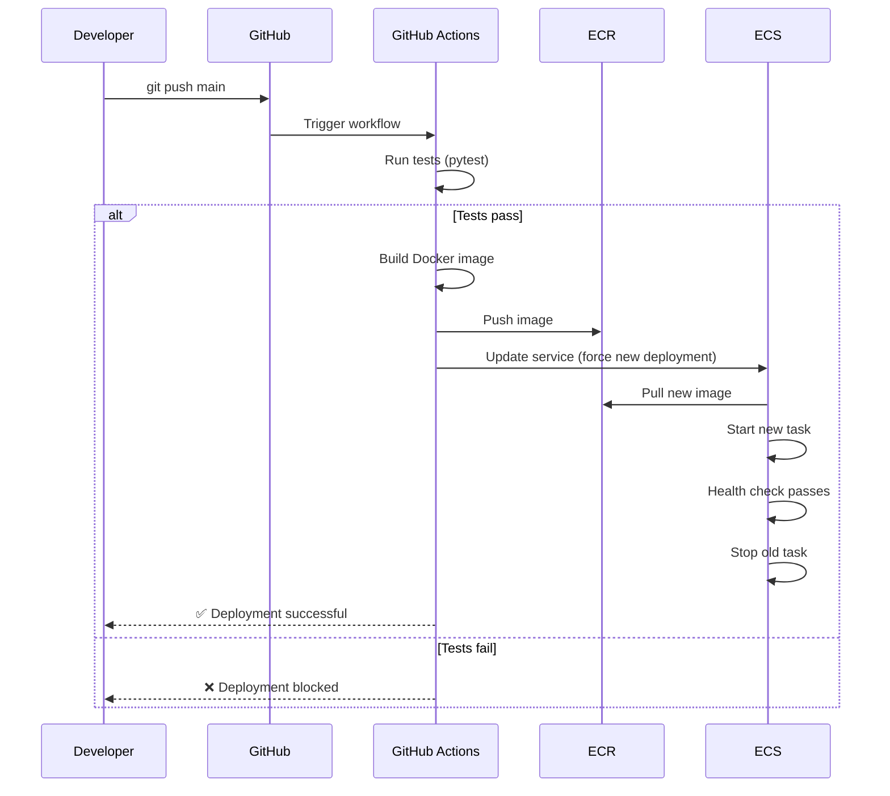

# MLOps Cloud Demo - System Architecture

## High-Level Architecture

## Component Details

### 1. CI/CD Pipeline
- **GitHub Actions**: Automated testing, Docker build, and deployment
- **Workflow**: Test → Build → Push to ECR → Deploy to ECS
- **Trigger**: Push to main branch

### 2. Cloud Infrastructure (AWS)
- **ECS Fargate**: Serverless container orchestration
- **Application Load Balancer**: HTTP traffic routing
- **VPC**: Isolated network with public/private subnets
- **ECR**: Docker image registry
- **S3**: Model artifact storage

### 3. API Service
- **FastAPI**: High-performance Python web framework
- **Endpoints**: `/health`, `/predict`, `/metrics`, `/docs`
- **Model**: scikit-learn Random Forest loaded from S3
- **Container**: 0.25 vCPU, 512MB RAM (AWS Free Tier eligible)

### 4. Monitoring & Observability
- **CloudWatch Logs**: Application logs from ECS tasks
- **CloudWatch Metrics**: Custom metrics (requests, errors, latency)
- **CloudWatch Dashboard**: Real-time visualization
- **Status Page**: Public GitHub Pages dashboard

### 5. Data Pipeline
- **Apache Airflow**: Orchestrates data ingestion and preprocessing
- **DAGs**: 
  - `data_ingestion_dag.py`: Download and validate wine quality dataset
  - `model_training_dag.py`: Train and upload model to S3
- **Storage**: Raw data and trained models stored in S3

## Security Architecture

### IAM Best Practices Implemented
- ✅ Separate admin and developer users
- ✅ Least-privilege policies (read-only S3 access for tasks)
- ✅ Service-specific roles (ECS task execution vs task role)
- ✅ CloudWatch permissions separated (logs vs metrics)

## Data Flow

## Deployment Flow

## Cost Optimization

| Component | Configuration | Monthly Cost (Est.) |
|-----------|--------------|---------------------|
| ECS Fargate | 0.25 vCPU, 512MB, 24/7 | ~$5-7 |
| Application Load Balancer | Single AZ | ~$16 |
| S3 Storage | <1 GB | <$0.10 |
| CloudWatch Logs | <1 GB | <$1 |
| CloudWatch Metrics | 5 custom metrics | $1.50 |
| **Total** | | **~$23-25/month** |

### Free Tier Benefits
- ✅ ECS Fargate: 20 GB-hours free (covers ~10 days)
- ✅ S3: 5 GB storage free
- ✅ CloudWatch: 10 custom metrics free (using 5)

## Technology Stack

| Layer | Technology |
|-------|-----------|
| **Infrastructure** | Terraform, AWS VPC, ECS Fargate, ALB |
| **Container** | Docker, ECR |
| **API** | FastAPI, Python 3.9, Uvicorn |
| **ML** | scikit-learn, pandas, numpy |
| **CI/CD** | GitHub Actions |
| **Monitoring** | CloudWatch Logs, Metrics, Dashboards |
| **Data Pipeline** | Apache Airflow, Docker Compose |
| **Storage** | AWS S3 |

## Related Documentation

- [AWS Setup Guide](./docs/aws-setup/)
- [Data Pipeline Documentation](./docs/data-pipeline/)
- [API Documentation](./docs/model-api/)
- [Troubleshooting Guide](./docs/troubleshooting/)
- [CloudWatch Setup](./docs/monitoring/cloudwatch-setup.md)
